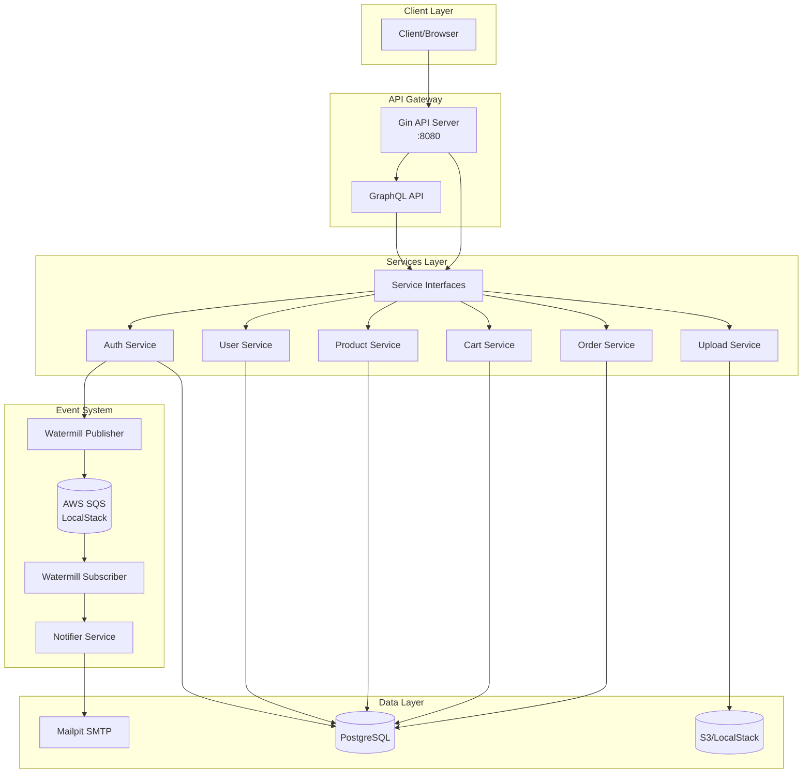
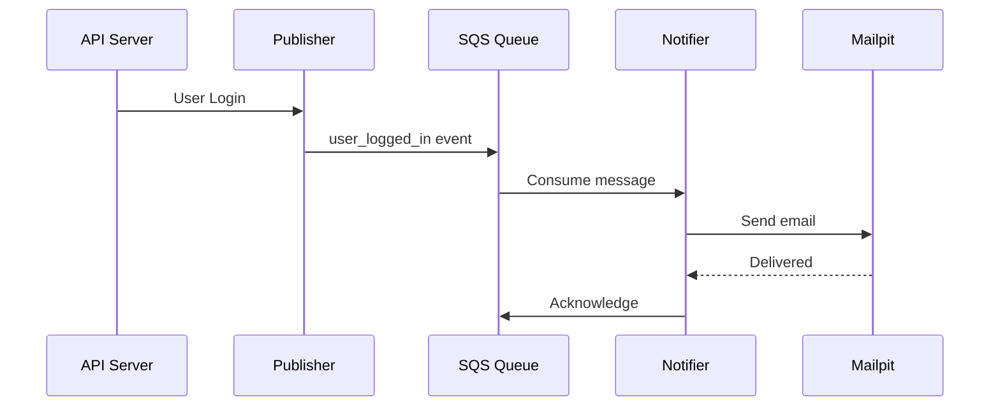
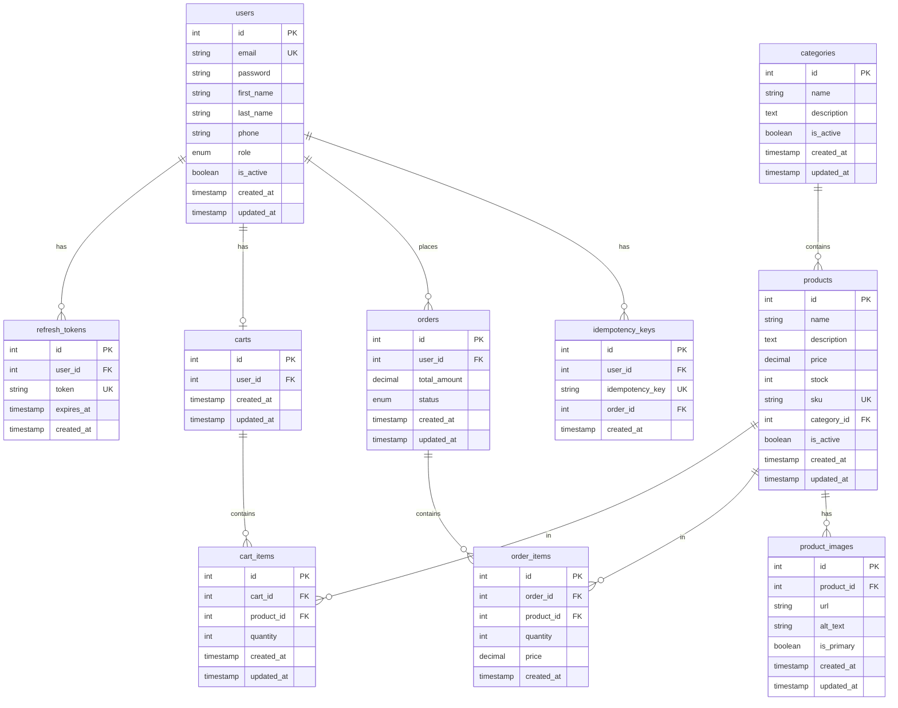

# Go AI Store

A production-ready e-commerce API built with Go, featuring **REST and GraphQL** APIs, JWT authentication, PostgreSQL, event-driven architecture, and Docker containerization.

## Architecture



## Features

- **Dual API Architecture**
  - RESTful API with OpenAPI/Swagger documentation
  - GraphQL API with Playground UI
  - Unified service layer via interfaces

- **Authentication & Authorization**
  - JWT-based authentication with access/refresh tokens
  - Role-based access control (User/Admin)
  - Secure password hashing with bcrypt

- **E-commerce Core**
  - Products with categories and image management
  - Shopping cart management
  - Order processing with status tracking
  - Timestamp tracking (createdAt/updatedAt) on all entities
  - Image uploads to S3

- **Event-Driven Architecture**
  - Watermill message broker integration
  - SQS-based event queue
  - Async email notifications

- **Clean Architecture**
  - Service interfaces for testability and mocking
  - Dependency injection throughout
  - Type-safe database access with sqlc

- **Infrastructure**
  - PostgreSQL with migrations
  - Docker Compose for local development
  - LocalStack for AWS services (S3, SQS)
  - Mailpit for email testing

## Tech Stack

| Category | Technology |
|----------|------------|
| Language | Go 1.25 |
| Framework | Gin |
| GraphQL | gqlgen |
| Database | PostgreSQL 15 + pgx/v5 |
| ORM | sqlc (type-safe SQL) |
| Auth | JWT (golang-jwt/v5) |
| Events | Watermill + AWS SQS |
| Storage | AWS S3 |
| Docs | Swagger/OpenAPI |
| Logging | zerolog |
| Linting | golangci-lint |

## Project Structure

```
go-ai-store/
├── cmd/
│   ├── api/              # Main API server
│   └── notifier/         # Email notification service
├── db/
│   ├── migrations/       # SQL migrations
│   ├── queries/          # sqlc query definitions
│   └── sqlc/             # Generated Go code
├── docker/
│   ├── docker-compose.yml
│   └── Dockerfile
├── docs/                 # Swagger documentation
├── graph/
│   ├── resolver/         # GraphQL resolvers
│   ├── schema/           # GraphQL schema files (.graphqls)
│   ├── generated.go      # gqlgen generated code
│   └── helpers.go        # Auth middleware for GraphQL
├── internal/
│   ├── config/           # Configuration loading
│   ├── database/         # Database connection
│   ├── dto/              # Request/response DTOs
│   ├── events/           # Event publisher/subscriber
│   ├── interfaces/       # Service interfaces
│   ├── logger/           # Structured logging
│   ├── notifications/    # Email service
│   ├── providers/        # AWS, upload providers
│   ├── server/           # HTTP handlers & routes
│   ├── services/         # Business logic
│   └── utils/            # Helpers (JWT, password, etc.)
├── gqlgen.yml            # GraphQL code generation config
├── Makefile
├── sqlc.yaml
└── go.mod
```

## Getting Started

### Prerequisites

- Go 1.25+
- Docker & Docker Compose
- Make

### Quick Start

```bash
# Clone the repository
git clone https://github.com/trenchesdeveloper/go-ai-store.git
cd go-ai-store

# Copy environment file
cp .env.example .env

# Start infrastructure (PostgreSQL, LocalStack, Mailpit)
make docker-up

# Run database migrations
make migrate-up

# Start the API
make run
```

### Docker Development

```bash
# Start all services including API & Notifier
docker compose -f docker/docker-compose.yml up -d --build

# View logs
docker logs api --tail 50
docker logs notifier --tail 50

# Stop all services
make docker-down
```

## API Reference

### Authentication

| Method | Endpoint | Description | Auth |
|--------|----------|-------------|------|
| POST | `/api/v1/auth/register` | Register new user | - |
| POST | `/api/v1/auth/login` | Login user | - |
| POST | `/api/v1/auth/refresh-token` | Refresh access token | - |
| POST | `/api/v1/auth/logout` | Logout user | - |

### User

| Method | Endpoint | Description | Auth |
|--------|----------|-------------|------|
| GET | `/api/v1/user/profile` | Get user profile | Bearer |
| PUT | `/api/v1/user/profile` | Update profile | Bearer |

### Products

| Method | Endpoint | Description | Auth |
|--------|----------|-------------|------|
| GET | `/api/v1/products` | List products | - |
| GET | `/api/v1/products/:id` | Get product | - |
| POST | `/api/v1/products` | Create product | Admin |
| PUT | `/api/v1/products/:id` | Update product | Admin |
| DELETE | `/api/v1/products/:id` | Delete product | Admin |
| POST | `/api/v1/products/:id/image` | Upload image | Admin |

### Categories

| Method | Endpoint | Description | Auth |
|--------|----------|-------------|------|
| GET | `/api/v1/categories` | List categories | - |
| POST | `/api/v1/categories` | Create category | Admin |
| PUT | `/api/v1/categories/:id` | Update category | Admin |
| DELETE | `/api/v1/categories/:id` | Delete category | Admin |

### Cart

| Method | Endpoint | Description | Auth |
|--------|----------|-------------|------|
| GET | `/api/v1/cart` | Get cart | Bearer |
| POST | `/api/v1/cart/items` | Add item to cart | Bearer |
| PUT | `/api/v1/cart/items/:itemId` | Update cart item | Bearer |
| DELETE | `/api/v1/cart/items/:itemId` | Remove cart item | Bearer |
| DELETE | `/api/v1/cart` | Clear cart | Bearer |

### Orders

| Method | Endpoint | Description | Auth |
|--------|----------|-------------|------|
| POST | `/api/v1/orders` | Create order | Bearer |
| GET | `/api/v1/orders` | List user orders | Bearer |
| GET | `/api/v1/orders/:id` | Get order details | Bearer |
| POST | `/api/v1/orders/:id/cancel` | Cancel order | Bearer |
| PUT | `/api/v1/orders/:id/status` | Update order status | Admin |

### Documentation

| Endpoint | Description |
|----------|-------------|
| `/health` | Health check |
| `/playground` | GraphQL Playground |
| `/graphql` | GraphQL API endpoint |
| `/docs/` | Swagger UI |
| `/api-docs` | RapiDoc UI |

## GraphQL API

The GraphQL API provides a flexible, type-safe alternative to the REST endpoints.

### Playground

Access the interactive GraphQL Playground at: `http://localhost:8080/playground`

### Example Queries

```graphql
# Get current user
query {
  me {
    id
    email
    firstName
    createdAt
    updatedAt
  }
}

# List products
query {
  products(page: 1, limit: 10) {
    id
    name
    price
    category {
      name
    }
  }
}

# Get user's cart
query {
  cart {
    id
    total
    cartItems {
      product {
        name
        price
      }
      quantity
    }
  }
}
```

### Example Mutations

```graphql
# Login
mutation {
  login(input: { email: "user@example.com", password: "password" }) {
    accessToken
    refreshToken
    user {
      email
    }
  }
}

# Add to cart
mutation {
  addToCart(input: { productId: 1, quantity: 2 }) {
    id
    total
  }
}

# Create order
mutation {
  createOrder {
    id
    status
    totalAmount
  }
}
```

## Event System



### Supported Events

| Event Type | Trigger | Email |
|------------|---------|-------|
| `user_logged_in` | User login | Login notification |
| `welcome` | User registration | Welcome email |
| `password_reset` | Reset request | Reset link |
| `order_confirmation` | Order placed | Order details |

## Database Schema



## Configuration

### Environment Variables

```bash
# Server
PORT=8080
GIN_MODE=debug

# Database
DB_HOST=localhost
DB_PORT=5432
DB_USER=postgres
DB_PASSWORD=postgres
DB_NAME=ecommerce
DB_SSL_MODE=disable

# JWT
JWT_SECRET=your-secret-key
JWT_EXPIRES_IN=24h
REFRESH_TOKEN_EXPIRES_IN=72h

# AWS/LocalStack
AWS_S3_ENDPOINT=http://localhost:4566
AWS_S3_BUCKET=ecommerce-uploads
AWS_S3_REGION=us-east-1
AWS_S3_ACCESS_KEY=localstack
AWS_S3_SECRET_KEY=localstack
AWS_EVENT_QUEUE_NAME=ecommerce-events

# SMTP
SMTP_HOST=localhost
SMTP_PORT=1025
SMTP_FROM=noreply@example.com

# Upload
UPLOAD_PROVIDER=s3
UPLOAD_PATH=uploads
MAX_UPLOAD_SIZE=10485760
```

## Make Commands

| Command | Description |
|---------|-------------|
| `make build` | Build all binaries |
| `make run` | Run API server |
| `make dev` | Run with race detector |
| `make lint` | Run linter |
| `make fix` | Auto-fix lint issues |
| `make migrate-up` | Run migrations |
| `make migrate-down` | Rollback migrations |
| `make docker-up` | Start Docker services |
| `make docker-down` | Stop Docker services |
| `make sqlc` | Generate database code |
| `make graphql-generate` | Generate GraphQL code |
| `make swagger` | Generate Swagger docs |

## Services (Docker)

| Service | Port | Description |
|---------|------|-------------|
| api | 8000 | Go API server |
| notifier | - | Email notification worker |
| postgres | 5432 | PostgreSQL database |
| localstack | 4566 | AWS S3 & SQS emulation |
| mailpit | 8025 (UI), 1025 (SMTP) | Email testing |
| cdn | 8081 | Nginx static file server |

## Development

### Generate Database Code

```bash
# Add new query in db/queries/
# Then regenerate
make sqlc
```

### Create New Migration

```bash
make migratecreate name=add_new_table
```

### Regenerate Swagger Docs

```bash
make docs-generate
```

## Testing

```bash
# View emails in Mailpit
open http://localhost:8025

# Test login flow
curl -X POST http://localhost:8000/api/v1/auth/login \
  -H "Content-Type: application/json" \
  -d '{"email": "user@example.com", "password": "password"}'

# Check notifier logs
docker logs notifier --tail 20
```

## License

Apache 2.0
